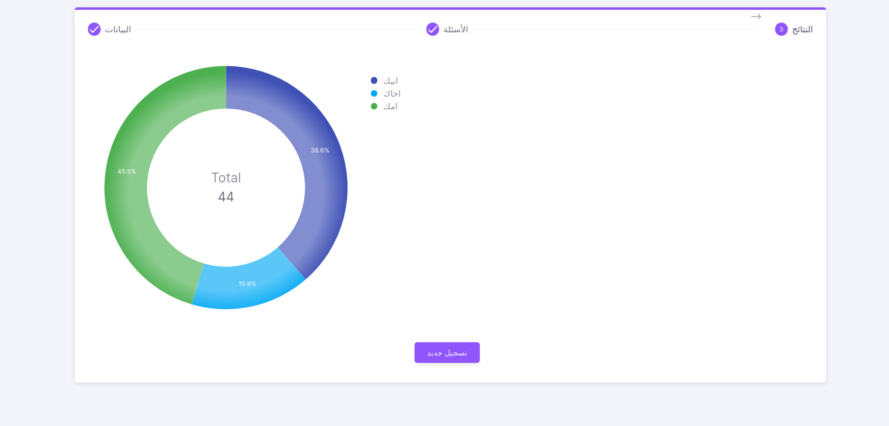

<p align="center">
   <a target="_blank">
      
   </a>
</p>

<a target="_blank" align="center">
   <h1 align="center">Questionnaire App</h1>
</a>



## Introduction

When it comes to collecting feedback, Questionnaire-App survey questions are one of the most effective tools you can use. They introduce very little friction to your users while allowing you to ask for specific feedback

## Install
1- git clone to questionnair app 
```sh
$ git clone https://github.com/OmarMohamedSayed/QuestionnaireApp.git
$ cd QuestionnaireApp/
```
2- go to back-end folder 
and install it 
By following the instructions in README file [README-BackEnd](./back-end/README.md)

3- create question in admin dashboard 

4- go to front-end folder
and install it 
By following the instructions in README file [README-FrontEnd](./front-end/README.md)

### Note
you can download my database and use it [Database-folder](./back-end/database)
