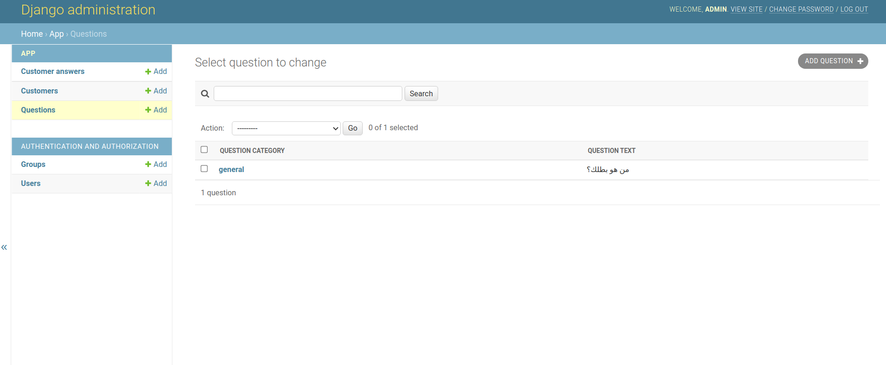
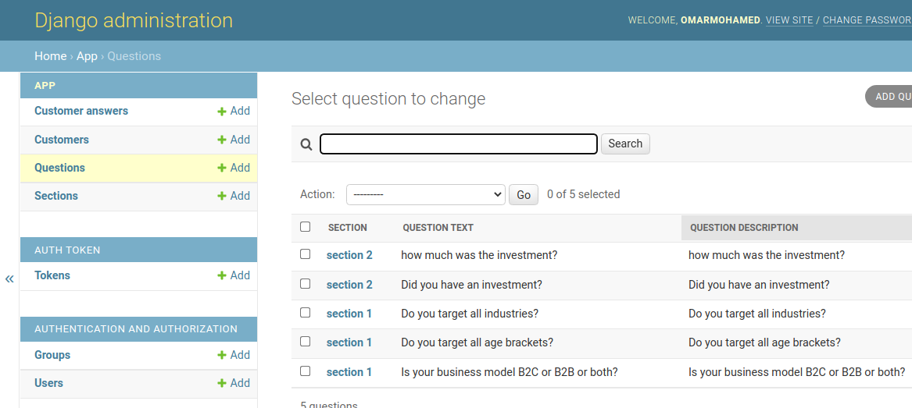
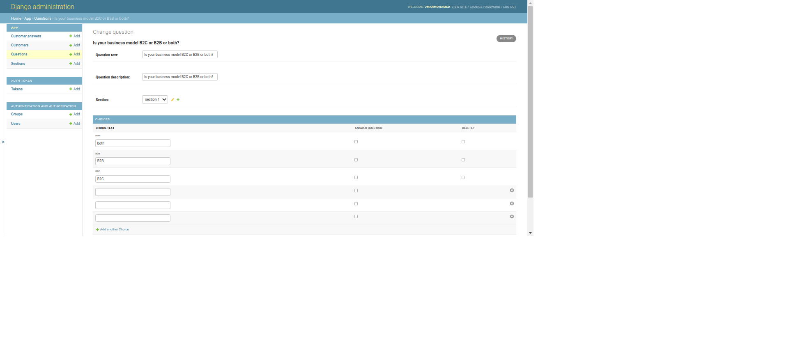

# Questionnaire App




## Features
1. Authentication (login, register) with JWT Token
2. Add Sections
3. Add Questions and Answers
4. Make customers choose and submit his answers
5. view customer answers
6. Customer can submit many times

## Setup

The first thing to do is to clone the repository:

```sh
$ git clone https://github.com/OmarMohamedSayed/QuestionnaireApp.git
$ cd QuestionnaireApp/back-end
```

Create a virtual environment to install dependencies in and activate it:

```sh
$ virtualenv venv -p python3
$ source venv/bin/activate

```
if you don't have virtualenv package you can download through
```sh
$ pip install virtualenv

```
Then install the dependencies:

```sh
(env)$ pip install -r requirements.txt
```
Note the `(venv)` in front of the prompt. This indicates that this terminal
session operates in a virtual environment set up by `virtualenv2`.

Once `pip` has finished downloading the dependencies:
Create admin user to insert questions and control all application through
```sh
(venv)$ python manage.py createsuperuser
```
Before run your application you need to create database with name questionnaire
```sh
(venv)$ sudo su - postgres psql
postgres=# create database questionnaire;
```
Then close terminal and run 
```sh
(venv)$ python manage migrate
(venv)$ python manage makemigrations app
(venv)$ python manage migrate
```


Now You can run your application through
```sh
(venv)$ python manage.py runserver
```
And navigate to `http://127.0.0.1:8000/admin/`
to insert your questions and answers

## Model 


## Api

"register":  "http://localhost:8000/api/register/"

"login": " http://localhost:8000/api/login/"

"refresh token": "http://localhost:8000/api/token/refresh/"

"questions": "http://127.0.0.1:8000/api/questions/"

"customers": "http://127.0.0.1:8000/api/customers/"

"customer-answers": "http://127.0.0.1:8000/api/customeranswers/"


