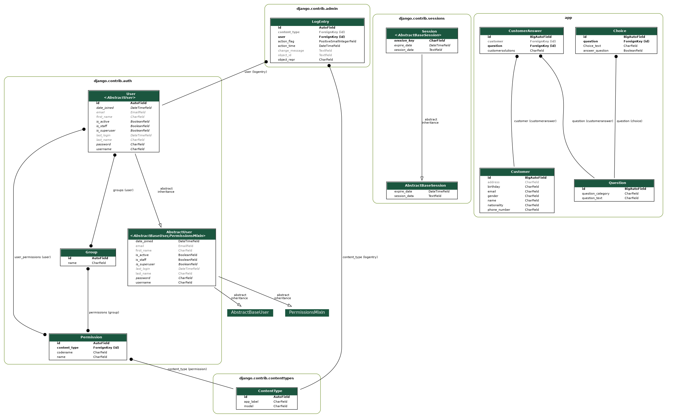

# GoCardless sample application

## Setup

The first thing to do is to clone the repository:

```sh
$ https://github.com/OmarMohamedSayed/QuestionnaireApp.git
$ cd QuestionnaireApp/back-end
```

Create a virtual environment to install dependencies in and activate it:

```sh
$ virtualenv venv -p python3
$ source venv/bin/activate

```
if you don't have virtualenv package you can download through
```sh
$ pip install virtualenv

```
Then install the dependencies:

```sh
(env)$ pip install -r requirements.txt
```
Note the `(venv)` in front of the prompt. This indicates that this terminal
session operates in a virtual environment set up by `virtualenv2`.

Once `pip` has finished downloading the dependencies:
Create admin user to insert questions and control all application through
```sh
(venv)$ python manage.py createsuperuser
```

Now You can run your application through
```sh
(venv)$ python manage.py runserver
```
And navigate to `http://127.0.0.1:8000/admin/`
to insert your questions and answers

## Model 



