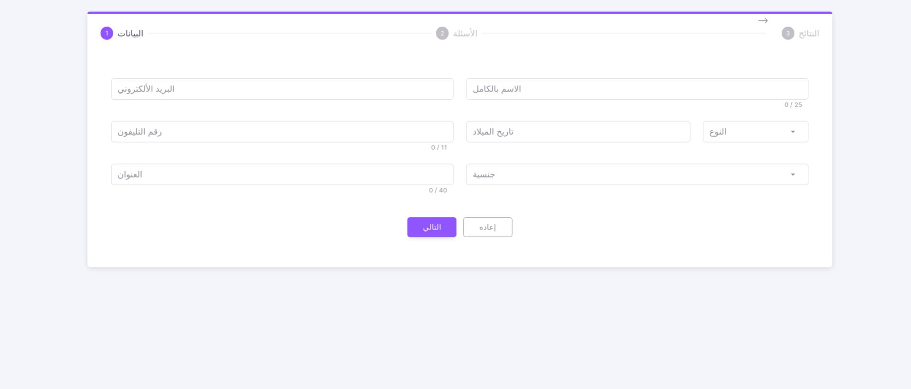
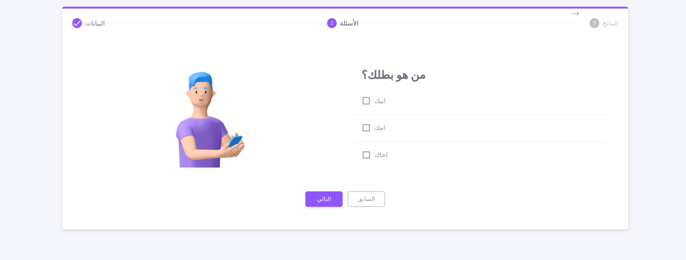

<p align="center">
   <a target="_blank">
      
   </a>
</p>

<a target="_blank" align="center">
   <h1 align="center">Questionnaire App</h1>
</a>




## Introduction

When it comes to collecting feedback, Questionnaire-App survey questions are one of the most effective tools you can use. They introduce very little friction to your users while allowing you to ask for specific feedback

## Installation ⚒️

> We recommend you use npm

1. Install all packages

   ```bash
   cd QuestionnaireApp/front-end
   npm install
   ```

2. Run development server

   ```bash
   npm run serve
   ```

3. Generate build files for deployment

   ```bash
   npm run build
   ```

## What's Included 📦

- Pages
  - Dashboard
  - Questions
  - Analysis page for all feedback to this question

## Credits 🙏

- [Vuetify](https://vuetifyjs.com/)
- [Material Design Icons](https://materialdesignicons.com/)
- [ApexCharts](https://apexcharts.com/)

